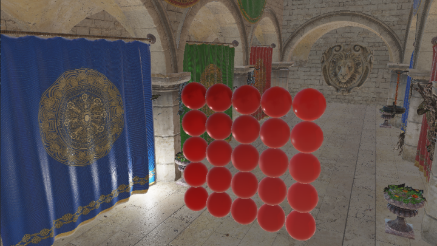
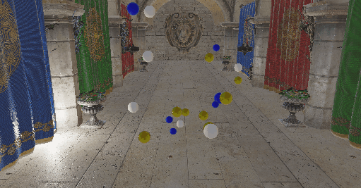

# ANKEngine
This is a 3D graphics engine used for learning about 3D techniques and DX11.

# Work in progress:
* Instanced rendering optimization
* Basic engine editor interface

# Completed
* Directx 11 PBR/IBL implementation
* Simple ECS System
